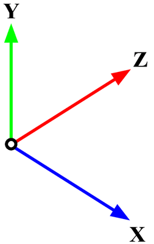

# Extended Reality Open Replay (XROR)

The Extended Reality Open Recording (XROR) format is a binary data format purpose-built for storing telemetry and event data streams from a wide variety of extended reality applications and devices.

Internally, XROR is based on the Binary JavaScript Object Notation (BSON) encoding format, with each .xror recording file containing a number of metadata attributes encoded as standard BSON attribute types. However, floaing point arrays, such as those used to store telemetry and event data streams, are compressed using `fpzip` and stored as raw binary data.

`fpzip` is a lossless floating point compression standard developed by Lawrence Livermore specifically for handling scientific data; it significantly outperforms general-purpose compression formats (e.g., lzma, deflate) for XR recordings, with a 50% compression ratio being typical.

This repository includes an open-source XROR library in Python for reading and decompressing XROR files in a single step, as well as bidirectional conversion between XROR and a number of other standard formats. Usage examples are provided below.

## XROR Structure

When opening an XROR file with a standard BSON reader, the following attributes may be present:

- **$id** (string, integer, uuid): A unique identifier for this recording.
- **info** (object): Metadata about this recording.
	- **name** (string): The name of this recording.
	- **timestamp** (date): Unix timestamp for the start of this recording.
	- **hardware** (object): Metadata about the hardware associated with this recording.
		- **devices** (array): The hardware devices associated with this recording.
	- **software** (object): Metadata about the software associated with this recording.
		- **api** (string): The API used by the application associated with this recording, such as OpenXR.
		- **runtime** (string): The runtime environment associated with this recording, such as SteamVR.
		- **app** (object): Metadata about the application associated with this recording.
			- **id** (string, integer, uuid): A unique identifier for the application associated with this recording.
			- **name** (string): The name of the application associated with this recording.
			- **version** (string): The version number of the application associated with this recording.
			- **extensions** (array): Metadata about extensions to the application associated with this recording.
				- **id** (string, integer, uuid): A unique identifier for the extension.
				- **name** (string): The name of the extension.
				- **version** (string): The version number of the extension.
		- **environment** (object): Metadata about the virtual environment associated with this recording.
			- **id** (string, integer, uuid): A unique identifier for the environment associated with this recording.
			- **name** (string): The name of the virtual environment associated with this recording.
		- **activity** (object): Metadata about the activity associated with this recording.
			- **id** (string, integer, uuid): A unique identifier for the activity associated with this recording.
			- **name** (string): The name of the activity associated with this recording.
	- **user** (object): Metadata about the user associated with this recording.
		- **id** (string, integer, uuid): A unique identifier for the user associated with this recording.
		- **name** (string): The name of the user associated with this recording.
- **frames** (binData): The sequence of telemetry data frames comprising this recording; consists of a fpzip-compressed 2D array of floats, with one entry per frame. Each entry starts with the time of the frame in seconds elapsed since the start of the recording, and then includes the telemetry data associated with the frame, with one number for each tracked axis specified in devices.
- **events** (array): A sequence of events contained in this recording.
	- **id** (string): A unique identifier for the type of event.
	- **name** (string): The name of the type of event.
	- **attr** (array): The names of the attributes associated with this type of event. Lists all floating-point attributes first, followed by all other attributes.
	- **floatData** (binData): The occurrences of the event type contained in this recording; consists of a fpzip-compressed 2D array of floats, with one entry per occurrence. Each entry starts with the time of the event in seconds elapsed since the start of the recording, and then includes the floating point attribute values associated with the occurrence.
	- **otherData** (array): The occurrences of the event type contained in this recording; consists of a 2D array of values, with one entry per occurrence. Each entry includes the non-float attribute values associated with the occurrence.

XROR files are sparse, meaning that most attributes are optional, and also extensible, meaning that attributes beyond those listed above may also be included.

## Conventions

By convention, XROR files with 3DOF or 6DOF tracked objects use Unity's (left-handed, y-up) coordinate system, shown below. In this coordinate system, _1.0 units equals 1.0 meters_ of real-world distance. When looking from the origin in the +Z direction:

- +Y is up
- +X is right
- +Z is forward

It is not strictly necessary to follow this convention. However, if you choose to use a different coordinate system, or a unit of measure other than meters, your documentation should clearly state how and why you deviate from these defaults.



## Usage Examples

Create and save a basic XROR file:
```
xror = XROR(name = 'Example')
xror.addDevice(name = 'HAND', type = 'HAND', axes = ['x', 'y', 'z'])
xror.addFrame(0, [1.0, 1.5, 2.0])
with open('./sample.xror', 'wb') as f:
    f.write(xror.pack())
```

Open and read a basic XROR file:
```
with open('./data/tilt/sample.xror', 'rb') as f:
    file = f.read()
xror = XROR.unpack(file)
```

Convert a BeatLeader .bsor file to XROR:
```
with open('sample.bsor', 'rb') as f:
	xror = XROR.fromBSOR(f)
with open('from-bsor.xror', 'wb') as f:
	f.write(xror.pack())
```

Convert a ScoreSaber .dat file to XROR:
```
xror = XROR.fromSS('sample.dat')
with open('from-dat.xror', 'wb') as f:
	f.write(xror.pack())
```

Convert a Tilt Brush .tilt file to XROR:
```
xror = XROR.fromTilt('sample.TILT')
with open('from-tilt.xror', 'wb') as f:
	f.write(xror.pack())
```
